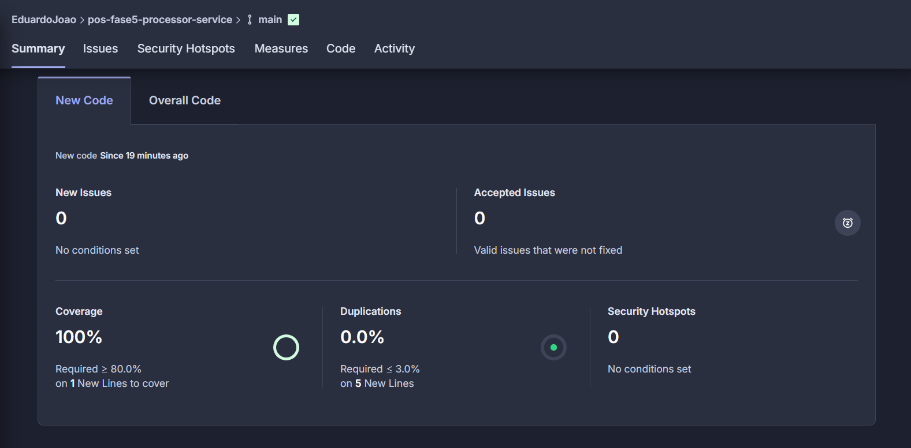

# Serviço de Pedidos - Sistema de Gestão para Fast Food

Este serviço gerencia pedidos e produtos para um sistema de lanchonete de fast food, oferecendo endpoints para criação, listagem e gerenciamento de produtos e pedidos.

## Responsabilidades

- Gerenciamento completo do catálogo de produtos (CRUD)
- Processamento de pedidos dos clientes
- Acompanhamento do status dos pedidos (fluxo completo, do registro à entrega)
- Controle do status de pagamento dos pedidos

## Endpoints Disponíveis

### Produtos

| Método | Endpoint | Descrição | Autenticação |
|--------|----------|-----------|--------------|
| POST | `/produtos` | Criar um novo produto | Não |
| GET | `/produtos?categoria={categoria}` | Listar produtos por categoria | Não |
| PUT | `/produtos/{id}` | Atualizar um produto existente | Não |
| DELETE | `/produtos/{id}` | Remover um produto | Não |

### Pedidos

| Método | Endpoint | Descrição | Autenticação |
|--------|----------|-----------|--------------|
| POST | `/pedidos` | Criar um novo pedido | **Token JWT requerido** |
| GET | `/pedidos` | Listar todos os pedidos | **Token JWT requerido** |
| PATCH | `/pedidos/{id}` | Alterar o status de um pedido | **Token JWT requerido** |

## Modelos de Dados

### Produto
```json
{
  "id": "string",
  "nome": "Hambúrguer",
  "descricao": "Hambúrguer artesanal com queijo, alface e tomate",
  "preco": 15.99,
  "categoria": "LANCHE"
}
```

### Pedido
```json
{
  "id": "string",
  "cpfCliente": "string",
  "produtos": [
    {
      "id": "string",
      "nome": "string",
      "descricao": "string",
      "preco": 0,
      "categoria": "LANCHE"
    }
  ],
  "statusPedido": "CRIADO",
  "statusPagamento": "PENDENTE",
  "total": 29.99,
  "dataCriacao": "string"
}
```
```bash
# Build
mvn clean package

# Cobertura de teste
mvn verify

```

## Evidência de cobertura de teste
